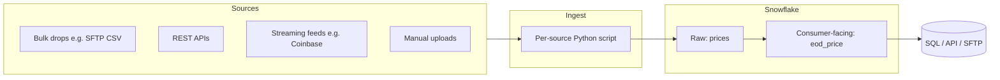

# Part 1: Design

## What I'm scoping

The brief asks for a data platform that handles ingestion, ETL, a warehouse, and analytics for a financial services firm. It also calls out that the data comes in four shapes (large dumps, small frequent updates, infrequent sources, and rapid streams) and that consumers come in four kinds (engineering teams, data analysts, finance and compliance, and external counterparties). On top of that, the brief is pretty explicit about scoping V1 tightly and being honest about what's getting deferred.

So my V1 covers the minimum I think is needed to handle all four data shapes credibly, and to give Part 2 something to sit on. Most of the things you'd see in a larger data platform (a broker, an orchestrator, a catalog, dbt, a real observability stack, multi-role RBAC) are in V2, each with an explicit trigger for when I'd actually go build it. They're all genuinely useful tools, they just don't really earn their keep at the volume and pipeline count I'm dealing with here.

A few things I clarified with Radu up front:

- Snowflake is required. Everything else is up to me, as long as it's actually runnable.
- The volume should be roughly "Coinbase-ish," which is pretty small in warehouse terms.
- The EoD price is the last trade observed strictly before `17:00:00.000000 ET`.

## Architecture

End to end, there are two components: a Python script per source and Snowflake. Inside Snowflake I have two layers: a raw table (`prices`) that's basically a copy of what came in, and a consumer-facing table (`eod_price`) that everyone actually queries.

Most of the design decisions below are about what I'm *not* building yet and why I think that's the right call.

## Components

Ingest scripts. Each source gets its own Python script. The script connects to the source, pulls down the data, projects it to the raw-table shape, and inserts the rows into Snowflake with `executemany`. There's no shared connector framework or anything fancy, it's just normal Python, one file per source. When a new source comes online I add a new script, and nothing else in the platform has to change.

Snowflake tables. Two tables, two layers. `prices` is the raw layer: append-only, the rows as they came in (projected to `product_id`, `observed_at`, `price`), plus `_loaded_at` and `_source_file` columns for audit. `eod_price` is the consumer layer: typed, deduped, computed. Flat names work fine at one source; the `raw_<source>` naming convention (`raw_coinbase_trades`, `raw_bloomberg_quotes`) becomes useful once there are two or more sources to disambiguate.

Transforms. All transformations are plain Snowflake SQL run on a schedule. In V1 that's just a handful of `.sql` files invoked by cron or by Snowflake Tasks. dbt-core would be a pretty natural upgrade once I'm dealing with more than five or so models, or once I actually want tests and lineage across them, but for V1 the tooling overhead doesn't really pay off.

Scheduling. Scheduling is either cron locally or Snowflake Tasks running inside Snowflake itself. A real orchestrator like Dagster or Airflow is something I'd add in V2; they start to earn their keep once there are multiple pipelines with real cross-dependencies, which there aren't yet.

Serving. Serving in V1 is mostly just direct SQL. The four customer archetypes from the Q&A map onto it pretty cleanly:

- *Analysts* get Snowsight or their own notebook, with read access to the consumer tables. If an analyst's ad-hoc query starts becoming load-bearing, it gets promoted into a tracked `.sql` file alongside the rest of the SQL in the repo. That's the path from ad-hoc to production.
- *Finance and compliance* get the same SQL access as analysts, plus the audit columns on the raw rows. That's the "where did this number come from?" surface.
- *Engineering teams* in V1 just use the Snowflake connector and SQL. A small FastAPI in front of `eod_price` is an obvious next step the moment a team actually asks for one, but I'm not going to build it speculatively.
- *External counterparties* are V2 only, since there aren't any yet. When there are, the shape would be a scheduled job that writes a file to SFTP per counterparty config, and possibly Snowflake Secure Data Sharing as a second channel for any counterparty that happens to be on Snowflake.

Audit (the data integrity story). The audit story is what gives the platform its data-integrity claim, which in a financial services context really means "can you trace any number back to its source?" Every raw row carries `_loaded_at` and `_source_file` columns; `_source_file` is the source identifier plus a run ID (`coinbase/BTC-USD/20260530T120000Z-abc12345` for REST polls, `coinbase-ws/...` for stream rows, the original filename for bulk loads). So if compliance ever asks "how did we arrive at this value?", I can take any number from a consumer table, follow `_source_file` back to the rows in `prices` that produced it, and from there back to the load run or file. A dedicated `manifest` table with per-load row counts and checksums is the natural next step once there's more than one source feeding the same downstream table, or when compliance needs more than a string identifier; for V1 the audit columns alone are enough.

Observability. Observability in V1 is light. Every script logs to stdout in a consistent format (timestamp, source, action, row counts), so I can tail a file and see what's going on. Snowflake's `QUERY_HISTORY` view gives me free observability on the transform side: runtime, rows scanned, errors, all of it. And data quality lives in the Python wrapper around the MERGE; `eod.py` runs a follow-up `select` and exits non-zero if `eod_price` is empty, which catches the "ingest never produced any pre-17:00 data" case loudly enough to fail any cron run or Snowflake Task. Anything fancier (Prometheus, Grafana, paging) I'm deferring to V2.

Auth / RBAC. In a real production deployment I'd absolutely set up proper RBAC, with separate roles for the loader, for analysts, for finance (with audit-table access), and for external counterparties. For V1, I'm just using a single Snowflake user with the grants it needs to do its job. Adding roles later is a `GRANT` script rather than a rewrite, so I'm not pre-building that complexity.

## How the four data shapes map

| Shape | V1 mechanism |
|---|---|
| Large bulk dumps | A loader script parses the file and inserts rows with `executemany`. In Part 2 this is `ingest_file.py` for CSVs. |
| Small frequent updates | A cron-driven Python script polls the REST endpoint every N minutes and inserts. In Part 2 this is `ingest.py` against Coinbase's `/trades` endpoint. |
| Infrequent sources | Someone runs the bulk loader against a file on demand. Same code path as large dumps. |
| Rapid streams | A long-running Python process reads the stream, buffers in memory for a few seconds, and bulk-inserts with `executemany`. In Part 2 this is `stream.py` against Coinbase's `matches` WebSocket. A broker (Kafka/Redpanda) in front of the consumer is the V2 move once more than one downstream needs the same stream. |

The only thing that varies between modes is the ingest script itself. Everything downstream of the raw table is the same code path, which is what keeps the rest of the platform from having to know whether something came from a bulk drop or a WebSocket.

## V1 vs V2

In V1 I'm building:

- One ingest script per source, each writing directly to the raw Snowflake table via `executemany`.
- Two Snowflake tables: a raw `prices` table and a consumer-facing `eod_price` table.
- Plain SQL transformations.
- Audit columns (`_loaded_at`, `_source_file`) on raw rows.
- One Snowflake user.
- Direct SQL as the serving surface.
- Cron or Snowflake Tasks for scheduling.

Here's what I'm deferring to V2, with the trigger for each that would actually push me to build it:

- Proper RBAC: when there's a second human consumer, or any external counterparty.
- An orchestrator (Dagster or Airflow): when there are multiple pipelines with real cross-dependencies.
- dbt-core: when there are more than ~5 SQL models, or when I actually need tests and lineage across them.
- A staging-plus-marts split in Snowflake: when there are multiple sources feeding the same downstream table.
- A real catalog (DataHub or OpenMetadata): when non-SQL processes start producing tables, or the product count gets past ~50.
- A `manifest` table (per-load row counts, checksums, status): when there's more than one source feeding the same downstream table, or compliance needs more than the `_source_file` string for traceability.
- A stream broker (Kafka or Redpanda): when more than one consumer needs the same stream, or when bursts are too big for a single Python process to absorb.
- A landing area (filesystem in dev, S3 in prod): when there's more than one downstream consumer for the same raw bytes, raw data is large enough that warehouse storage is wasteful, or replay/re-parse without re-ingestion becomes a real need.
- Exactly-once streaming semantics: when a consumer actually requires strict ordering or no duplicates at the broker boundary.
- Snowflake Secure Data Sharing: when a counterparty turns out to be on Snowflake.
- A real observability stack: when there's an on-call rotation that needs proper paging.
- Multi-region DR: when compliance or continuity actually requires it.

The pattern there is that I'm not pre-building anything; each V2 item has a real customer or constraint that would push me to do it. And adding any one of them later is a refactor of one component rather than a redesign of the platform.

## Tradeoffs in a sentence each

- Snowflake as the only warehouse. Vendor concentration is real; for V1 I'm accepting it rather than hedging speculatively.
- Plain SQL over dbt in V1. Fewer moving parts, but I'm giving up tests, docs, and lineage that dbt would get me for free; dbt wins as soon as the model graph is real.
- Cron over an orchestrator. Cron is fine at one job; an orchestrator earns its keep at maybe five.
- No broker. A Python WS consumer with bounded in-memory buffering handles Coinbase-level rates pretty easily; brokers earn their keep when there are multiple consumers or when a single Python process can't absorb the bursts.
- One Snowflake user in V1. I'd never actually do this in production, but for the V1 scope it's the right tradeoff.
- No real obs stack. stdout plus `QUERY_HISTORY` is enough for one engineer.
- Direct SQL over a heavy API layer. Snowflake is the API in V1; FastAPI shows up when a consumer team actually needs HTTP semantics.
